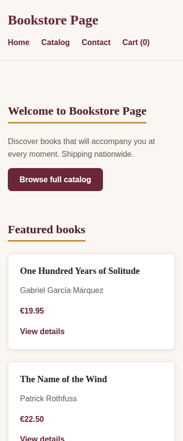

# Bookstore Ecommerce — Reference Solution

**Reference** repository for a bookstore ecommerce built epic by epic.
Each epic leaves the site as a functional, self-contained version.

> This repo is the **solution**. The student works in their own repository and
> uses this one to compare their progress with `git diff`.

## Stack

Semantic HTML · CSS · JavaScript (vanilla) · procedural PHP · MariaDB · PDO with
prepared statements. No framework, no Composer.

## Running locally

The web root is the `public/` folder, so serve the site pointing at it:

```bash
php -S localhost:8000 -t public
```

Then open <http://localhost:8000>. Keeping `public/` as the document root means
files outside it (database connection, configuration) are never reachable by URL.

## Epics

Each epic has a tag = an immutable snapshot of the increment. To explore one:

```bash
git checkout epic-1-home                 # move to an increment
git diff epic-1-home epic-2-pages        # compare two increments
git show epic-1-home                      # see a tag's summary and changes
```

| #   | Epic                                            | Tag                     | Status | Introduces                                          |
| --- | ----------------------------------------------- | ----------------------- | ------ | --------------------------------------------------- |
| 1   | [Home](#epic-1--home)                           | `epic-1-home`           | ✅     | Semantic HTML + CSS, responsive layout, identity    |
| 2   | [Secondary pages](#epic-2--secondary-pages)     | `epic-2-pages`          | ⏳     | header/footer as PHP `include`, first PHP           |
| 3   | [Product listing](#epic-3--product-listing)     | `epic-3-product-list`   | ⏳     | Schema, PDO connection, list real products, filter  |
| 4   | [Product detail](#epic-4--product-detail)       | `epic-4-product-detail` | ⏳     | Dynamic page with URL parameter                     |
| 5   | [Login](#epic-5--login)                         | `epic-5-login`          | ⏳     | Session login, protected area, logout               |
| 6   | [Cart](#epic-6--cart)                           | `epic-6-cart`           | ⏳     | Cart with PHP sessions + JS                         |
| 7   | [Checkout](#epic-7--checkout)                   | `epic-7-checkout`       | ⏳     | Form, validation, save order (no real payment)      |
| 8   | [Admin panel](#epic-8--admin-panel)             | `epic-8-admin`          | ⏳     | Product CRUD (reuses the login from epic 5)         |
| 9   | [Dashboard](#epic-9--dashboard)                 | `epic-9-dashboard`      | ⏳     | Sales statistics                                    |

✅ delivered · 🚧 in progress · ⏳ pending

## Epic previews

Each epic shows **what the student must build** by the end of that increment.
The screenshots live in [docs/screenshots/](docs/screenshots/) and are added when
each epic is closed.

### Epic 1 — Home

> What the student must build: the catalog home with semantic HTML, CSS, a basic responsive layout, and a visual identity.


<details>
<summary>Mobile view</summary>



</details>

### Epic 2 — Secondary pages

> What the student must build: the secondary pages (catalog, contact, about…) sharing a reusable header and footer via PHP `include` (first PHP).

_Pending — the screenshot will be added when the epic is closed._

### Epic 3 — Product listing

> What the student must build: the catalog listing real products from MariaDB via PDO, with a category filter.

_Pending — the screenshot will be added when the epic is closed._

### Epic 4 — Product detail

> What the student must build: the book detail page, generated from a URL parameter.

_Pending — the screenshot will be added when the epic is closed._

### Epic 5 — Login

> What the student must build: the session login, the protected area, and logout.

_Pending — the screenshot will be added when the epic is closed._

### Epic 6 — Cart

> What the student must build: the cart with PHP sessions and JavaScript.

_Pending — the screenshot will be added when the epic is closed._

### Epic 7 — Checkout

> What the student must build: the checkout form with validation and order saving (no real payment).

_Pending — the screenshot will be added when the epic is closed._

### Epic 8 — Admin panel

> What the student must build: the product CRUD, protected by the login from epic 5.

_Pending — the screenshot will be added when the epic is closed._

### Epic 9 — Dashboard

> What the student must build: the panel with sales statistics.

_Pending — the screenshot will be added when the epic is closed._

## Documents

- [BACKLOG.md](docs/BACKLOG.md) — user stories per epic.
- [STUDY-GUIDE.md](docs/STUDY-GUIDE.md) — study guide.
